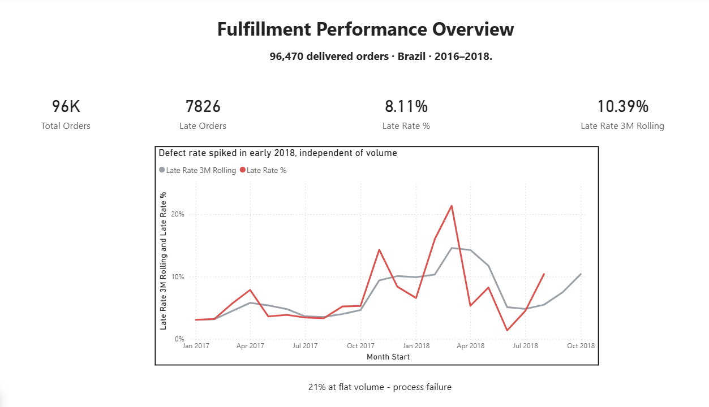
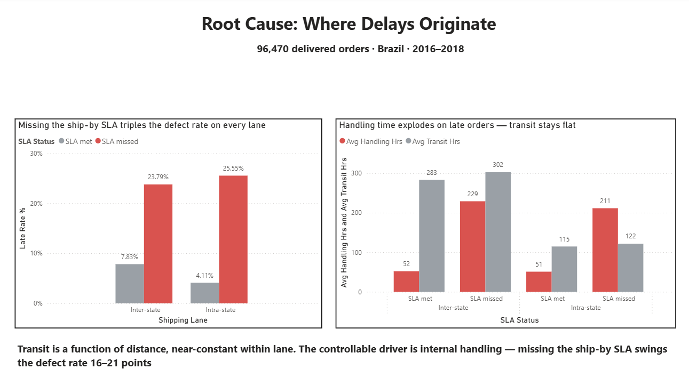
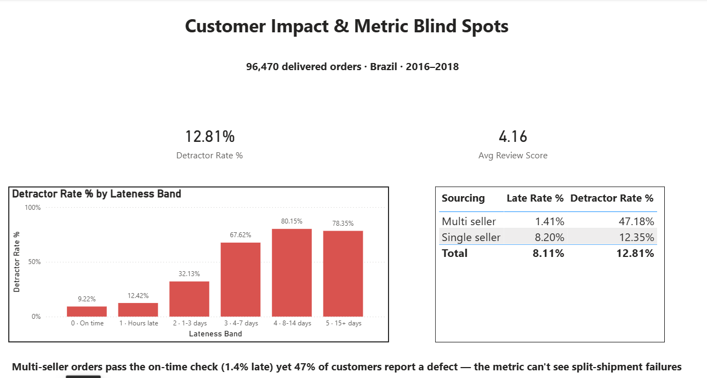

# Fulfillment Defect & Lead-Time Variance Analysis


---

An analysis of **96,470 delivered orders** to find out *why* deliveries arrive
late — not just how often. The short answer: the delays that look like a
shipping problem are mostly an internal handling problem, and the standard
on-time metric misses a whole class of defect entirely.

Built with **SQL Server, Python, and Power BI** on the public Olist Brazilian
e-commerce dataset.

📊 **[Download the full Power BI report (.pbix)](dashboard.pbix)**

---

## Dashboard Preview

### Fulfillment Performance Overview


### Root Cause: Where Delays Originate


### Customer Impact & Metric Blind Spots


---

## Why this dataset

Olist is real order data, not generated — over 100,000 orders with timestamps
for each stage of fulfillment: when the order was approved, when it was handed
to the carrier, when it reached the customer, and the date it was promised by.
That stage detail is what makes root-cause work possible.

The data is a 2016–2018 snapshot, so every finding here describes the dataset,
not the current market. It was chosen because genuine stage-level fulfillment
data isn't published by companies that run it live.

---

## The headline finding

The overall late-delivery rate is **8.11%** (7,826 of 96,470 delivered
orders). Splitting total fulfillment time into stages showed late orders took
756 hours end to end versus 261 for on-time orders — and at first glance
almost all of that gap was in transit (616 hours vs 189).

That pointed at the carrier. **It was wrong.**

Controlling for shipping lane (whether the seller and customer were in the same
state) changed the picture completely:

| Lane | Ship SLA | Late rate | Handling hrs | Transit hrs |
|---|---|---|---|---|
| Intra-state | Met | 4.11% | 51 | 115 |
| Intra-state | Missed | 25.55% | 211 | 122 |
| Inter-state | Met | 7.83% | 52 | 283 |
| Inter-state | Missed | 23.79% | 229 | 302 |

Transit barely moves when an order fails — it only changes with distance
(about 115 hours within a state, 290 hours across states, regardless of whether
the order was on time). What actually moves the defect rate is the **handling
stage** — the internal pick/pack/ship step. When a seller misses its ship-by
date, handling time roughly quadruples and the late rate jumps 16–21 points.

So the earlier "transit is the problem" read was a confound: late orders skew
toward long-distance lanes, and long distance inflates transit time. Once
distance is held constant, the controllable internal stage is the real driver.

> **Implication:** if orders that missed the ship-by date had performed at their
> own lane's normal rate, about **1,560 of the 7,826 late deliveries disappear —
> roughly 20% of all defects**, from fixing an internal stage with no carrier
> involvement.

---

## The metric blind spot

Multi-seller orders (a basket filled by more than one seller) look excellent on
the on-time metric — **98.65% on time** — but **47% of those customers leave a
1–2 star review**, versus about 12% for single-seller orders.

A metric that reports 98.65% success on a group where nearly half of customers
report a problem isn't measuring the right thing. The likely cause is that an
order's delivery date is a single timestamp, while a multi-seller order ships
as separate parcels — so the order can close as "delivered" while the customer
is still waiting on part of it.

This is a small slice of the data (1,261 orders, about 1.3%) and the exact
mechanism can't be confirmed from Olist's documentation. But the gap between
what the metric says and what customers report is real, and it's the kind of
completeness defect an inventory/quality function exists to catch.

A chi-square test of independence confirms the gap is not chance: χ² = 1158.9, p ≈ 5×10⁻²⁵⁴ (df = 1), on a 47.3% poor-review rate for multi-seller orders versus 13.7% for single-seller. The association is very strong and highly significant — but it's an association, not proof of cause. The split-parcel explanation above remains a hypothesis the test is consistent with, not a confirmed mechanism.
---

## Other findings

**Defects concentrate in a small number of sellers.** The top 25 sellers by
defect count (about 4% of active sellers) account for roughly a third of all
late deliveries. But most of them are high-*volume* sellers sitting near the
average defect rate — the genuinely broken performers are smaller sellers with
20–25% late rates hiding lower down the list. Those are two different fixes: the
big sellers give you the most defects to recover, the high-rate sellers are
where the process is actually failing.

**A defect spike in early 2018 that wasn't caused by demand.** February and
March 2018 hit 16% and 21% late rates at normal order volume — unlike the
November 2017 spike, which was Black Friday volume overwhelming capacity. A 21%
rate at flat volume points to a process failure rather than a demand shock, and
the 3-month rolling average shows it building from December onward.

**Bigger/heavier items don't fail more.** Audio products (1.2 kg) had the worst
defect rate; office furniture (11 kg, 20x the volume) sat at the average.
Physical handling difficulty doesn't predict defects here.

**Customer damage saturates.** Detractor rate climbs steeply from "hours late"
(12%) to "one week late" (68%), then flattens — orders 8–14 days late and 15+
days late are both around 80%. Once an order is roughly two weeks late, the
customer has already given the worst score they're going to give. The payoff
from intervention is in the first week.

**Geography barely matters once you correct for it.** Across the ten
multi-seller states, the defect rate ranges 4.0% to 8.8% — about 5 points,
versus the 16–21 point swing from missing the ship SLA. (The apparent "worst
state" in an early version, at 23% late, turned out to be a single seller — see
below.)

---

## Two mistakes I caught, and how

Both of these are in the repo on purpose. Finding them was part of the work.

**A single seller disguised as a bad region.** An early geographic query
flagged one state at a 23% defect rate. It turned out that state had exactly one
seller in the whole dataset — so it was a seller problem, not a geographic one.
The lesson: a minimum-order-count filter doesn't protect against one entity
dominating a group. The fix was to also require a minimum number of distinct
sellers per state, which removed the false signal and corrected the national
average by a full percentage point.

**A binning bug found by cross-checking counts.** When I grouped orders by how
late they were, the "15+ days late" band showed a suspicious dip in detractor
rate — worse-late orders getting *better* reviews. Cross-checking the counts
between two queries showed the band held 2,615 orders in one and 1,384 in
another. The cause: the CASE statement's catch-all ELSE was sweeping in orders
that were late by only hours (which register as "0 days" by calendar math) and
mixing them into the most-late bucket. Fixing the bins made the curve behave as
expected. The anomaly was in my code, not the data.

---

## Limitations

- **Right-censoring.** The analysis only includes orders marked delivered.
  Orders still in transit when the data was extracted are excluded — and slow
  orders are exactly the ones most likely to still be open. This understates
  lateness in the final months; the low rate for mid-2018 in particular should
  be read with that in mind.
- **The multi-seller finding rests on a small sample** (1,261 orders) and an
  unconfirmed timestamp mechanism. It's reported as an open question, not a
  settled result.
- **This is 2016–2018 data.** Nothing here describes the current market, and no
  defect rate was actually reduced — these are findings about a historical
  dataset, and the "20% recoverable" figure is a calculated implication, not a
  measured outcome.

---

## How it's built

```
Olist CSVs  ──►  Python loader  ──►  SQL Server (raw schema)
                                          │
                                          ▼
                              Staged fact tables (order grain + line grain,
                              stage durations precomputed in T-SQL)
                                          │
                                          ▼
                              Power BI star-schema model + DAX measures
                                          │
                                          ▼
                              3-page dashboard
```

| File | What it does |
|---|---|
| `01_create_schema.sql` | Creates the database and raw tables |
| `02_load_olist.py` | Loads the Olist CSVs into SQL Server |
| `03_add_keys_indexes.sql` | Validation, keys, indexes |
| `04_build_fact_table.sql` | Builds the order-level analysis table with stage durations |
| `05_root_cause_analysis.sql` | The eight analysis queries |
| `06_build_line_fact.sql` | Line-level table for the product/category view |
| `dashboard.pbix` | Three-page Power BI dashboard |

---

## To reproduce

1. Download the Olist dataset from Kaggle (search *"Brazilian E-Commerce Public
   Dataset by Olist"*) and unzip the nine CSVs into one folder.
2. Run `01_create_schema.sql` in SQL Server.
3. `pip install pandas sqlalchemy pyodbc`, then
   `python 02_load_olist.py --data-dir "path/to/csvs"`.
4. Run scripts `03` through `06` in order.
5. Open `dashboard.pbix` and point the connection at your database.

---

## Stack

**SQL Server** (T-SQL — window functions, CTEs, staged fact tables) ·
**Python** (pandas, SQLAlchemy, pyodbc for the load) ·
**Power BI** (star-schema model, DAX measures, three-page report)

*Data: Olist public e-commerce dataset, 2016–2018.*
